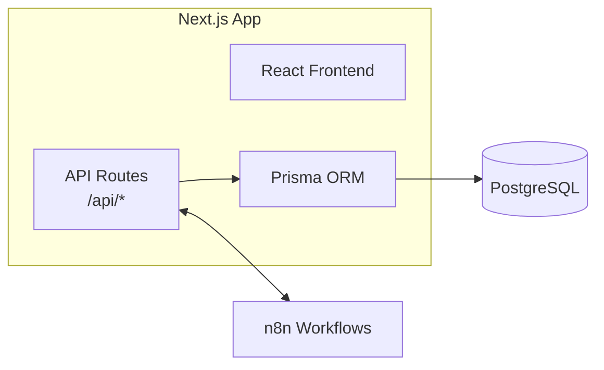
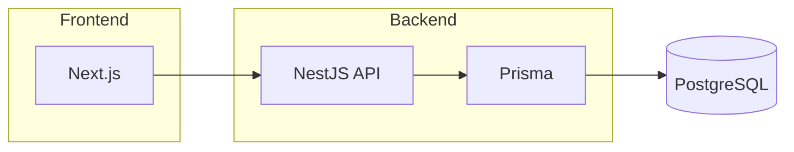

# Architecture Decisions: Payment Reminder App

## Project Scale Analysis

Before deciding, let's assess **what we're actually building**:

| Aspect | Reality |
|--------|---------|
| Users | 1 law firm (maybe 5-10 admin users) |
| Data volume | ~100s of clients, ~1000s of payments/year |
| Traffic | Low (dashboard used occasionally) |
| Critical path | n8n handles scheduling, not your backend |
| Real-time needs | None (notifications are scheduled) |

> [!IMPORTANT]
> This is a **small-to-medium business tool**, not a high-scale fintech platform. Over-engineering will cost you time and money without benefit.

---

## Decision 1: Monorepo vs Separate Repos

### Option A: Monorepo with Turborepo (Recommended ✅)

```
uucpl/
├── apps/
│   ├── web/          # Next.js frontend + API routes
│   └── n8n-workflows/ # n8n workflow JSON exports
├── packages/
│   ├── database/     # Prisma schema + client
│   ├── types/        # Shared TypeScript types
│   └── ui/           # Shared UI components (optional)
├── turbo.json
└── package.json
```

**Pros**: Single repo, shared types, easy deployment, good for small teams  
**Cons**: Slightly more setup

### Option B: Separate Repos

```
uucpl-frontend/   # Next.js
uucpl-backend/    # NestJS
```

**Pros**: Independent deployments  
**Cons**: Type drift, more maintenance, overkill for this project

### My Recommendation: **Option A (Monorepo)**

- You're a solo/small team
- Next.js App Router already gives you full-stack capability
- Shared types between frontend and API = fewer bugs

---

## Decision 2: Next.js vs NestJS

### Option A: Next.js Only (Recommended ✅)



**Pros**:

- Single codebase, single deployment
- API Routes are sufficient for CRUD + webhooks
- You already know Next.js
- Deploy frontend + API together on Vercel

**Cons**:

- If backend grows massively complex later, might need refactor

### Option B: Next.js + NestJS (Microservice)



**Pros**:

- NestJS has better structure for complex business logic
- Decorators, modules, DI pattern

**Cons**:

- **Overkill for this project** - you're building CRUD + webhooks
- Two deployments to manage
- More infrastructure complexity
- Learning curve if you don't know NestJS

### My Recommendation: **Option A (Next.js Only)**

- Your heavy lifting is done by n8n, not your backend
- API routes handle: CRUD for clients/payments, webhook endpoints
- This doesn't need gRPC, Kafka, or microservices

---

## Decision 3: gRPC / Kafka / Message Queues

### Do You Need Them?

| Technology | Use Case | Your App |
|------------|----------|----------|
| **gRPC** | High-performance service-to-service communication | ❌ No services to communicate |
| **Kafka** | Event streaming, millions of events/sec | ❌ ~100 notifications/day |
| **RabbitMQ** | Message queuing between services | ❌ n8n handles all async work |
| **Redis Queue** | Background job processing | ❌ n8n does this |

> [!CAUTION]
> Adding Kafka or gRPC to this project would be **massive over-engineering**. These are for Netflix/Uber scale, not a law firm with 100 clients.

### What You Actually Need

- **n8n** = Your message queue and job scheduler (already handles async)
- **PostgreSQL** = Your data store
- **Direct API calls** = Frontend to backend communication

---

## Decision 4: Deployment Strategy

### Option A: Vercel + Managed Services (Recommended ✅)

| Component | Where | Cost |
|-----------|-------|------|
| Next.js (frontend + API) | Vercel | Free tier / $20/mo |
| PostgreSQL | Supabase / Neon / PlanetScale | Free tier available |
| n8n | Railway / Render / AWS EC2 | $5-20/mo |

**Pros**: Zero DevOps, auto-scaling, easy  
**Deployment**: `git push` → auto-deploy

### Option B: All on AWS

| Component | AWS Service | Cost |
|-----------|-------------|------|
| Next.js | AWS Amplify or ECS | $10-50/mo |
| PostgreSQL | RDS or Aurora | $15-50/mo |
| n8n | EC2 t3.small | $15/mo |

**Pros**: Everything in one cloud, more control  
**Cons**: More DevOps work, more expensive for small scale

### Option C: Hybrid (My Recommendation ✅)

| Component | Where | Why |
|-----------|-------|-----|
| Next.js | **Vercel** | Best Next.js hosting, free, zero config |
| PostgreSQL | **Supabase** or **Neon** | Free tier, managed, easy |
| n8n | **Railway** or **Render** | $5/mo, one-click Docker deploy |

---

## Final Recommendation

```
┌─────────────────────────────────────────────────────────────┐
│                    RECOMMENDED STACK                        │
├─────────────────────────────────────────────────────────────┤
│  Structure:    Turborepo Monorepo                           │
│  Frontend:     Next.js 14+ with App Router                  │
│  Backend:      Next.js API Routes (no separate backend)     │
│  Database:     PostgreSQL (Supabase/Neon)                   │
│  ORM:          Prisma                                       │
│  Automation:   n8n (Railway/Render)                         │
│  Deployment:   Vercel (Next.js) + Railway (n8n)            │
│  gRPC/Kafka:   ❌ Not needed                                │
│  NestJS:       ❌ Not needed for this scale                 │
└─────────────────────────────────────────────────────────────┘
```

---

## When Would You Need NestJS/Microservices?

Consider upgrading if:

- Multiple law firms (multi-tenant SaaS)
- 10,000+ daily active users
- Real-time features (WebSockets)
- Complex business rules spanning multiple domains
- Team of 5+ backend developers

For now, **start simple and scale when needed**.

---

## Your Input Needed

Please confirm:

1. **Monorepo with Turborepo?** ✅ / ❌
2. **Next.js only (no NestJS)?** ✅ / ❌
3. **Skip gRPC/Kafka?** ✅ / ❌
4. **Vercel + Supabase + Railway deployment?** ✅ / ❌

Once you confirm, I'll set up the project structure step by step!
