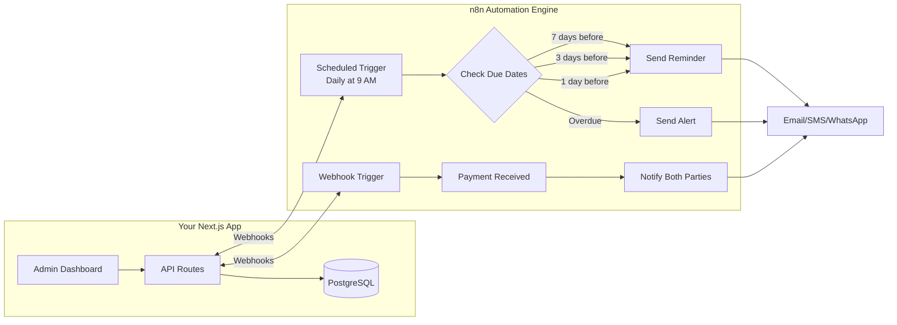
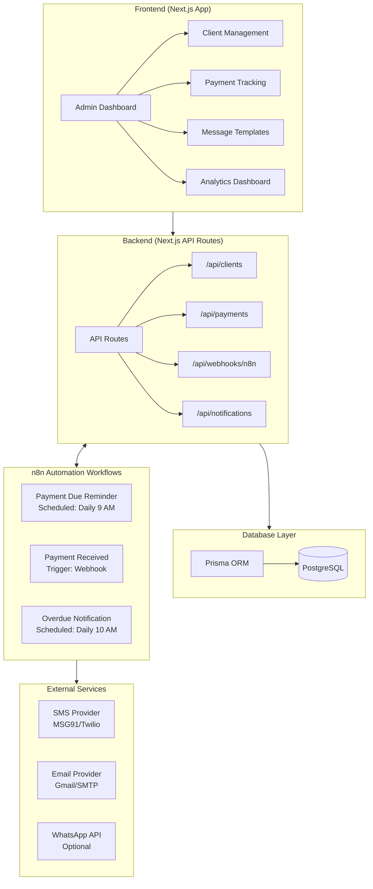
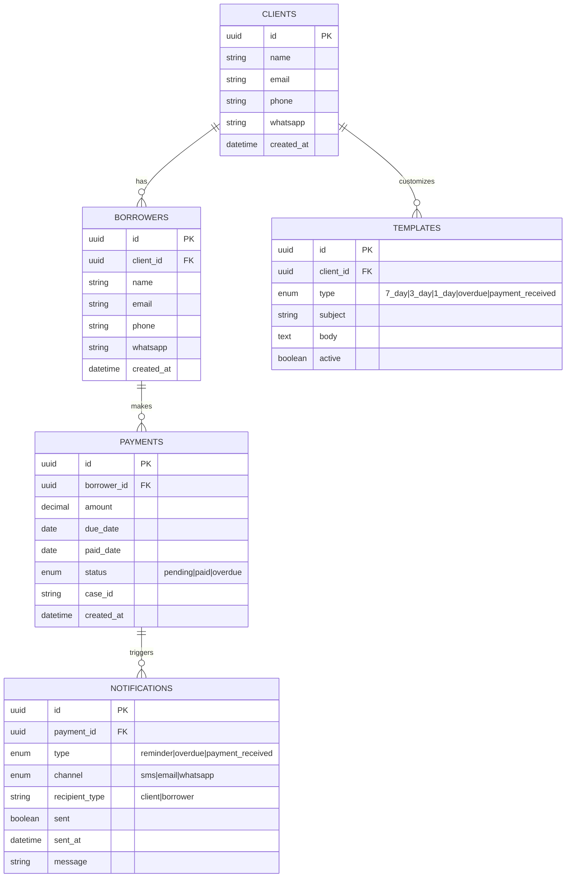
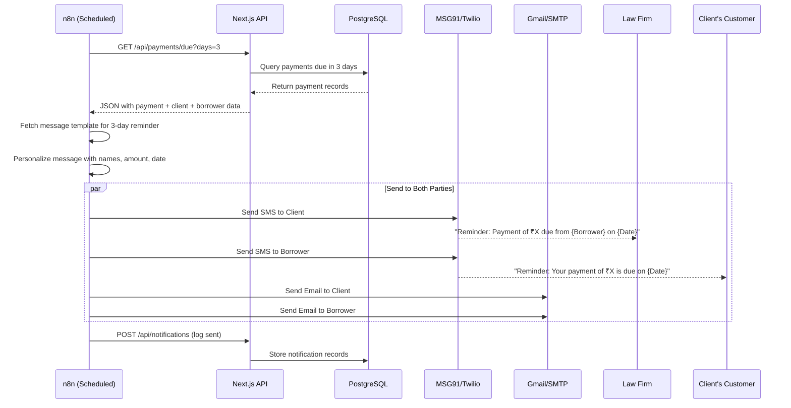
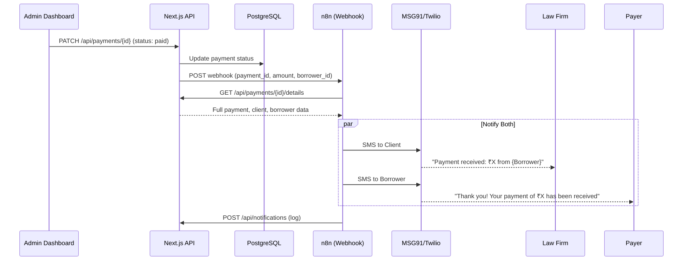

# Law Firm Payment & Deadline Reminder Automation App

## Executive Summary

Based on the client's spec documents, this app automates payment reminders and deadline notifications for a law firm. The solution combines:

- **Next.js + TypeScript** for the web application (admin dashboard, API)
- **n8n** for workflow automation (scheduling, triggers, notifications)
- **PostgreSQL** for data storage
- **SMS/Email providers** for multi-channel notifications

---

## What is n8n and Where It Fits

> [!TIP]
> **n8n in Simple Terms**: Think of n8n as a visual "if this, then that" tool for developers. It's like Zapier but open-source, self-hostable, and much more powerful.

### n8n's Role in This Project



### How Next.js and n8n Communicate

| Action | Direction | Method |
|--------|-----------|--------|
| New payment recorded | Next.js → n8n | Webhook call from API route |
| Daily due date check | n8n → Next.js | Scheduled trigger fetches from API |
| Send notification | n8n → External | SMS/Email provider integration |
| Update notification status | n8n → Next.js | Webhook callback to API |

---

## Complete System Architecture



---

## Recommended Tech Stack

| Layer | Technology | Why |
|-------|------------|-----|
| **Frontend** | Next.js 14+ with TypeScript | You already know it, SSR, API routes |
| **Styling** | Tailwind CSS or Vanilla CSS | Fast prototyping |
| **Database** | PostgreSQL | Robust, free, supports scheduling queries |
| **ORM** | Prisma | Type-safe, great DX with TypeScript |
| **Automation** | n8n (self-hosted via Docker) | Open-source, visual workflows, integrates with everything |
| **SMS** | MSG91 (India) or Twilio | From client spec |
| **Email** | Gmail/SMTP or SendGrid | Simple, reliable |
| **WhatsApp** | Twilio WhatsApp API | Optional, from client spec |
| **Hosting** | Vercel (Next.js) + VPS (n8n) | Easy deployment split |

---

## Database Schema Design



---

## n8n Workflow Details

### Workflow 1: Daily Payment Due Reminder

```
┌─────────────────┐    ┌──────────────┐    ┌─────────────────┐    ┌──────────────┐
│  Schedule       │ -> │ HTTP Request │ -> │ Filter/Switch   │ -> │ Send SMS     │
│  (Daily 9 AM)   │    │ GET /api/    │    │ (7d/3d/1d)      │    │ Send Email   │
│                 │    │ payments/due │    │                 │    │ (Parallel)   │
└─────────────────┘    └──────────────┘    └─────────────────┘    └──────────────┘
                                                                         │
                                                                         v
                                                               ┌──────────────────┐
                                                               │ HTTP Request     │
                                                               │ POST /api/       │
                                                               │ notifications    │
                                                               │ (Log sent)       │
                                                               └──────────────────┘
```

**Logic**:

1. Runs daily at 9 AM
2. Fetches all pending payments from your Next.js API
3. Filters based on due date proximity (7 days, 3 days, 1 day)
4. Fetches client-specific message templates
5. Sends SMS/Email to BOTH client and borrower
6. Logs notification to your database

### Workflow 2: Payment Received Notification

```
┌─────────────────┐    ┌──────────────┐    ┌─────────────────┐
│  Webhook        │ -> │ Fetch Client │ -> │ Send SMS/Email  │
│  (From your     │    │ & Borrower   │    │ to BOTH parties │
│   Next.js API)  │    │ details      │    │                 │
└─────────────────┘    └──────────────┘    └─────────────────┘
```

**Trigger**: When you mark a payment as "paid" in your Next.js app, the API calls n8n webhook.

### Workflow 3: Overdue Payment Alert

```
┌─────────────────┐    ┌──────────────┐    ┌─────────────────┐    ┌──────────────┐
│  Schedule       │ -> │ HTTP Request │ -> │ Send Overdue    │ -> │ Optional:    │
│  (Daily 10 AM)  │    │ GET /api/    │    │ SMS/Email       │    │ Slack Alert  │
│                 │    │ payments/    │    │ to BOTH parties │    │ to Finance   │
│                 │    │ overdue      │    │                 │    │              │
└─────────────────┘    └──────────────┘    └─────────────────┘    └──────────────┘
```

---

## Implementation Steps

### Phase 1: Project Setup (Day 1-2)

```bash
# Create Next.js project
npx create-next-app@latest payment-reminder --typescript --tailwind --app

# Install dependencies
npm install prisma @prisma/client axios
npm install -D @types/node

# Initialize Prisma
npx prisma init
```

### Phase 2: Database Setup (Day 2-3)

1. Create PostgreSQL database (local or hosted like Supabase/Neon)
2. Define Prisma schema with tables above
3. Run migrations: `npx prisma migrate dev`

### Phase 3: API Development (Day 3-5)

Build these API routes:

| Route | Method | Purpose |
|-------|--------|---------|
| `/api/clients` | GET, POST | Manage clients |
| `/api/borrowers` | GET, POST | Manage borrowers |
| `/api/payments` | GET, POST, PATCH | Payment CRUD |
| `/api/payments/due` | GET | Get payments due in next 7 days |
| `/api/payments/overdue` | GET | Get overdue payments |
| `/api/webhooks/n8n/payment-received` | POST | Trigger from n8n |
| `/api/notifications` | POST | Log sent notifications |
| `/api/templates` | GET, POST, PATCH | Message templates |

### Phase 4: n8n Setup (Day 5-6)

**Option A: Self-hosted (Recommended for production)**

```bash
# Using Docker
docker run -d --name n8n \
  -p 5678:5678 \
  -v ~/.n8n:/home/node/.n8n \
  n8nio/n8n
```

**Option B: n8n Cloud**

- Sign up at [n8n.cloud](https://n8n.cloud)
- Free tier available for development

### Phase 5: Build n8n Workflows (Day 6-8)

1. Import/create the 3 workflows described above
2. Configure SMS provider credentials (MSG91/Twilio)
3. Configure email provider
4. Test with sample data

### Phase 6: Frontend Dashboard (Day 8-12)

Build pages:

- `/dashboard` - Overview with stats
- `/clients` - Client management
- `/payments` - Payment tracking
- `/notifications` - History & logs
- `/templates` - Customize message templates

---

## Complete Data Flow Example

### Scenario: Payment Due in 3 Days



### Scenario: Payment Received



---

## Project Folder Structure

```
payment-reminder/
├── app/
│   ├── page.tsx                    # Landing/Login
│   ├── dashboard/
│   │   └── page.tsx                # Main dashboard
│   ├── clients/
│   │   ├── page.tsx                # Client list
│   │   └── [id]/page.tsx           # Client details
│   ├── payments/
│   │   ├── page.tsx                # Payment list
│   │   └── [id]/page.tsx           # Payment details
│   ├── notifications/
│   │   └── page.tsx                # Notification history
│   ├── templates/
│   │   └── page.tsx                # Message templates
│   └── api/
│       ├── clients/
│       │   └── route.ts
│       ├── borrowers/
│       │   └── route.ts
│       ├── payments/
│       │   ├── route.ts
│       │   ├── due/route.ts
│       │   └── overdue/route.ts
│       ├── notifications/
│       │   └── route.ts
│       ├── templates/
│       │   └── route.ts
│       └── webhooks/
│           └── n8n/
│               └── route.ts
├── prisma/
│   └── schema.prisma
├── lib/
│   ├── prisma.ts                   # Prisma client
│   └── utils.ts
├── components/
│   ├── Dashboard/
│   ├── ClientForm/
│   ├── PaymentTable/
│   └── ...
└── n8n-workflows/                  # Export your n8n workflows as JSON
    ├── payment-due-reminder.json
    ├── payment-received.json
    └── overdue-alert.json
```

---

## User Review Required

> [!IMPORTANT]
> **Please confirm these decisions before I proceed:**

1. **Database Choice**: PostgreSQL (recommended) or would you prefer MySQL or a managed option like Supabase?

2. **n8n Hosting**:
   - Self-hosted via Docker (more control, runs on your VPS)
   - n8n Cloud (easier setup, paid after free tier)

3. **SMS Provider**: MSG91 (better for India) or Twilio (global)?

4. **Deployment Target**:
   - Next.js on Vercel + n8n on separate VPS?
   - Everything on a single VPS?

5. **Do you have existing bank integration or is payment tracking manual?**
   - If manual: Admin marks payments as received
   - If integrated: Can trigger n8n automatically from bank webhooks

---

## Verification Plan

### Development Testing

1. Create test data (mock clients, borrowers, payments)
2. Trigger n8n workflows manually and verify SMS/Email delivery
3. Check notification logs in database

### Integration Testing

1. Mark payment as "paid" in dashboard → Verify both parties receive notification
2. Wait for scheduled trigger → Verify reminder sent for due payments
3. Test template customization

### Manual Testing by User

- User will test notification delivery to their phone numbers
- User will verify dashboard UI meets requirements
- User will confirm message templates are correct

---

## Client Spec Documents Reference


